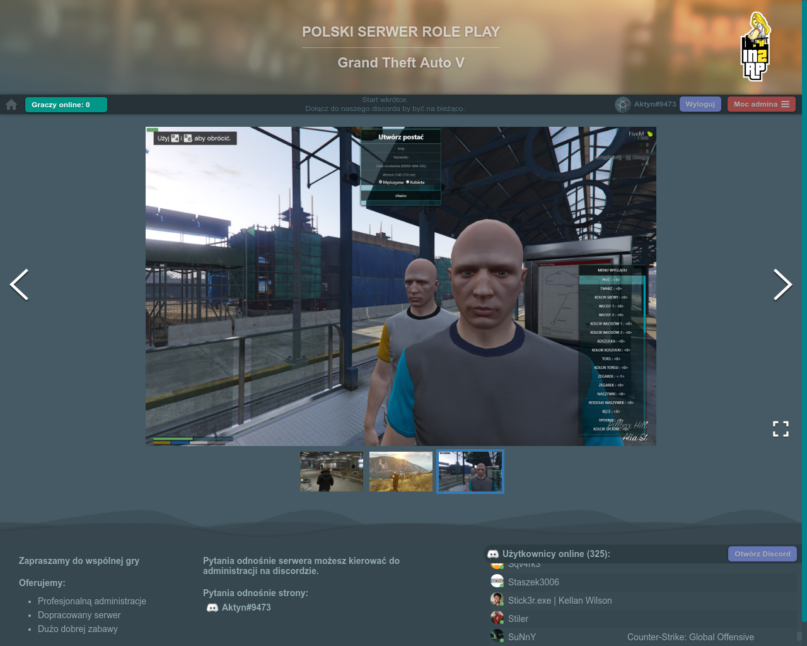
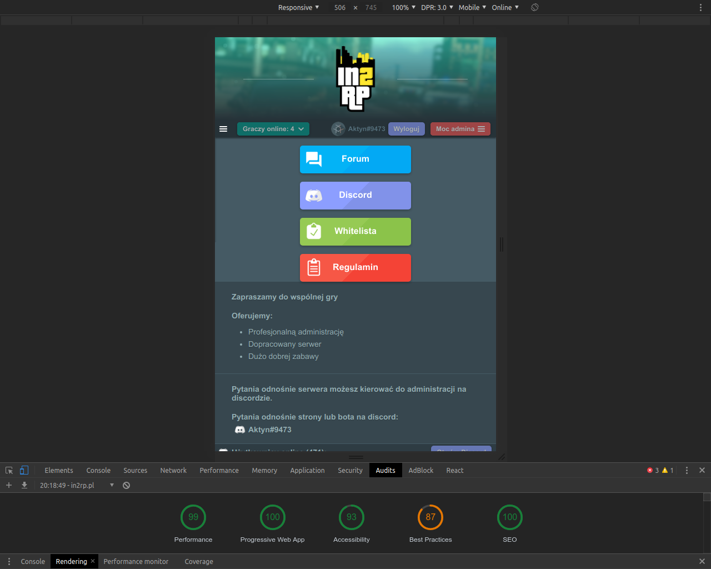

# Website and discord bot project for GTA V Role&nbsp;Play server

Website functionality includes:
- discord login and authentication system
- custom discord widget that displays list of currently online users
- widget that displays list of online players on the server
- special pages for admin users
    - server logs preview
    - whitelist applications preview and management
    - managing of website admins
    - page visits statistics
- submitting of applications for whitelist
- image gallery
- Separate page for server rules

The design is fully responsive, written in SASS without any external libraries.

Discord bot abilities:
- hangman game in private chat
- when a user accepts rules via giving reaction, the bot gives this user a role so he can see more channels
- interactive to-do list
- displaying server status like list of online players
- server management via commands eg: stop, start, restart, rcon
- notifications when someone sends whitelist application or when the application is accepted/rejected
- musicbot

Everything above is single bot instance. Not multiple bots.

